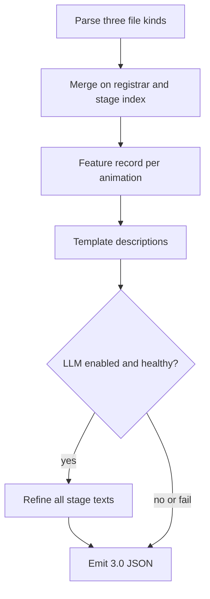

# Pipeline

Extract features from SLAL + source + FNIS, write a complete template description per stage, optionally refine with an LLM, emit anidata 3.0. Template draft is always the fallback.

## Stages of the writer

### 1. Parse

Read [how-to-read-animation.md](how-to-read-animation.md). One animation record per SLAL `id`. Source `.txt` is a Python-like DSL: **do not eval Python**. Scan for `id=`, `Stage(n, object=…)`, actor `object=`. Unknown syntax is logged and skipped.

### 2. Merge

| Source | What it adds |
|--------|----------------|
| SLAL JSON | `id`, `name`, tags, sound, actors, per-stage flags, optional animation-level sound |
| Source `.txt` | `object=` / furniture not present in JSON; section (`Solo 1p` / `Pair 2p`) |
| FNIS list | Same objects as a cross-check; `.hkx` names (not used for prose in v1) |
| Gold JSON | Optional join for eval / few-shot; never required to emit |

If source and FNIS disagree on objects for a stage, prefer FNIS (what the game attaches) and log the mismatch.

### 3. Feature record

[feature-record.md](feature-record.md). One record per animation, plus a per-stage row for each 1-based stage index.

### 4. Template writer

Must emit a non-empty string for every stage if parse succeeded. Stay SLAL-honest ([templates.md](templates.md)).

Suggested sentence order:

1. Pose / position from tags + `name` (Standing, Kneeling, Laying, Cowgirl, Doggy, …)
2. Act from tags (`Vaginal`, `Blowjob`, `Spanking`, `Masturbation`, …) using the primary-act table in [feature-signals.md](feature-signals.md)
3. Contact extras from objects, `open_mouth` (not automatic blowjob)
4. Stage delta only when a per-stage signal changed vs the previous stage

When nothing per-stage changed, keep the same core sentence. A mild last-stage climax clause is allowed when climax tags/`add_cum` exist. Do not write the word “heuristic” into anidata. `heuristic_arc` is dump-only.

Do not invent furniture or bindings that are not in tags or objects. `strap_on` is true on most Human males — mention only if it toggles or tags imply pegging/Femdom strap-on.

Actor tokens: `{{sl.actors.0}}` is SexLab position 0 (Billyy Human MF: Female). Never hard-code names.

Templates must be **deterministic**.

### 5. LLM refine

Input:

- Feature record (JSON)
- Template descriptions keyed `stage N`
- Few-shot gold from [animations-gold.md](animations-gold.md) (style and pose detail)

Output: JSON object with `stage N` → description strings only. Reject those stages (keep template) if:

- missing any stage the template had, or extra stages
- keys are `Stage 1` / `stage1` instead of `stage N`
- actor tokens are dropped, renamed, or out of range
- clothing is asserted in prose (belongs in `clothed`, see [emit.md](emit.md))
- furniture/bindings/object names not in the feature record
- markdown/code fences around the JSON
- actor count mismatch

On partial success, keep valid LLM stages and fill the rest from templates. LLM skip/fail → entire animation stays on templates.

Eval reports template scores and LLM scores separately (LLM is non-deterministic).

### 6. Emit

[emit.md](emit.md). `creator` provenance string e.g. `stage-descriptor-prototype` or `stage-descriptor-prototype+llm`.

## Failure policy

| Failure | Action |
|---------|--------|
| SLAL JSON unreadable | Fail the file; skip that pack |
| Actor stage counts differ | Fail the animation; log registrar |
| Source/FNIS missing | Continue; objects empty |
| Gold miss | Emit anyway; exclude from eval |
| LLM error | Entire animation stays on templates |
