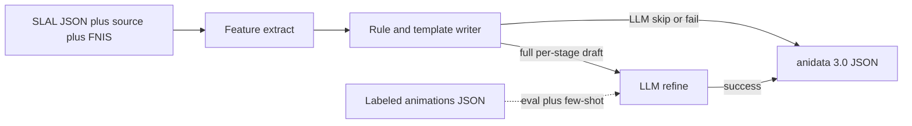

# Prototype plan

Standalone C++ tool that reads Billyy SLAL animation files, infers a full per-stage description from metadata, optionally refines that draft with an LLM, and emits anidata 3.0 JSON. Fold into SkyrimNet_SexLab only after offline eval is acceptable.

This document is the plan. Implementation of C++ is a later pass. Markdown contracts in this tree are done.

## Locked decisions

| Decision | Choice |
|----------|--------|
| First pack | Billyy Human (`Billyy_Human.json`, 117 anims) |
| Writer | Hybrid: templates always produce a complete **SLAL-honest** draft; LLM refines (may imitate gold pose detail); template is fallback |
| Join key | SLAL `id` (registrar) = gold filename stem, case-insensitive |
| v1 emit | Description-first 3.0; see [emit.md](emit.md) |
| HKX | Out of scope (offline prototype). Runtime HKX AniDescriber in SkyrimNet_SexLab is **on hold** — tags fill missing stages. |
| Few-shot | [animations-gold.md](animations-gold.md) only (complete Human labels + tokens). Currently 5 files; use all of them |
| Broken gold | [animations-broken.md](animations-broken.md) handoff — do not delete in this pass |
| Sparse gold | [animations-sparse.md](animations-sparse.md) — skip training; eval on present keys |

## Hybrid writer



Rules:

- If parse succeeds, every SexLab stage gets a non-empty template description.
- Templates change wording only when flags, objects, or sound overrides change. Mild last-stage climax is allowed when tags/`add_cum` support it. Intensity prior is `heuristic_arc` on the **feature dump only**, not in anidata.
- LLM input is structured features **and** the template draft. Output is a refined set of stage descriptions using `{{sl.actors.N}}`. Few-shot gold may include pose detail SLAL does not encode.
- On LLM skip, timeout, parse failure, or missing stages, keep the template text for those stages.

Honest limit: SLAL does not encode pose deltas. Canonical example: `B_B_SpankDog` in [how-to-read-animation.md](how-to-read-animation.md) and [templates.md](templates.md).

## Corpus slices

| Slice | Source | Status |
|-------|--------|--------|
| Human | `SLAnims/json/Billyy_Human.json` (117) | This pass |
| Other Billyy 10.5 | DD, Furniture, FurnitureDD, FurnitureInvis, Lesbian, LesbianDD, Gangbang, Orgy (230) | Next |
| Other sibling `*SLAL*` packs | [slal-directories.md](slal-directories.md) | Recorded, not inventoried |
| Creature Billyy | `B_Can_`, `B_Seek_`, `B_Drau_` packs | Later |
| Other authors | Leito, Anubs, … | After Billyy |

Gold labels: [SKSE/Plugins/SkyrimNet_SexLab/animations/](../SKSE/Plugins/SkyrimNet_SexLab/animations/). Human join: [labeled-corpus.md](labeled-corpus.md).

## Later C++ (not this pass)

New standalone CMake target under `descriptor/` (C++23, nlohmann-json). No CommonLibSSE, no SKSE, no Papyrus.

Suggested layout:

```text
descriptor/
  README.md
  CMakeLists.txt     (later)
  include/           (later)
  src/               (later)
```

CLI sketch:

```text
stage_descriptor
  --slal   path/to/Billyy_Human.json
  --source path/to/Billyy_Human.txt
  --fnis   path/to/FNIS_Billyy_Human_List.txt
  --gold   path/to/SKSE/Plugins/SkyrimNet_SexLab/animations
  --out    path/to/output/dir
  --llm    optional endpoint or off
```

Quote the Billyy pack path (apostrophe in `Billyy's SLAL Animations 10.5`). The pack is a sibling of this repo, not vendored.

First executable milestone: parse Human JSON, merge source/FNIS objects, join gold by registrar, dump [feature-record.md](feature-record.md), write template descriptions. LLM and emit-to-`animations/` come after that dump is reviewable.

**Fold-in:** [`LoadAnimJson`](../SKSE_Source/src/AnimationDB.cpp) **consumes** anidata under `animations/`. It does not parse SLAL, source `.txt`, or FNIS. Later fold-in means ship generated JSON for AnimDB to load, and optionally share nlohmann helpers. Do not parse SLAL inside `LoadAnimJson`. Do not wire SKSE until eval against gold is acceptable.

## Evaluation

Empty gold descriptions and [animations-broken.md](animations-broken.md) files are excluded from automatic eval and few-shot.

| Layer | Set | Measure |
|-------|-----|---------|
| Join | 117 Human ids | registrar hit / miss vs gold |
| Templates | non-broken matched files | **Hard gates:** actor tokens in range, no clothing, no names, no empty strings. **Honesty:** if flags/objects/sound did not change vs previous stage, text must not introduce a new pose/act/prop. **Gold (secondary):** token overlap only on non-empty gold keys |
| LLM | non-broken matched minus few-shot pool | Same hard gates; gold overlap secondary (gold may be richer than SLAL). Report template and LLM scores **separately** |
| Invented prop | generated text | Must not name furniture/bindings/objects absent from tags + FNIS/source objects |
| Human review | 10-file subset including `B_B_SpankDog` | Grounded vs gold-rich; tokens; no invented furniture |

Unmatched 63: smoke-read only. Sparse: score labeled stages only ([animations-sparse.md](animations-sparse.md)).

Provider conflict: prefer `GoodProvider`, then other folders alphabetically; log; do not merge.

Do not overwrite gold files during eval.

## Non-goals (this prototype)

- Parsing `.hkx` / pose analysis
- Writing or replacing files under `animations/` until a later, explicit pass
- Deleting gold listed in [animations-broken.md](animations-broken.md) (handoff only)
- In-game editor, Papyrus, or WebUI
- Creature packs and non-Billyy authors as few-shot
- Full emit-profile fields (`transitions`, SNSL `tags`) in v1
- Copying Billyy SLAL files into git
